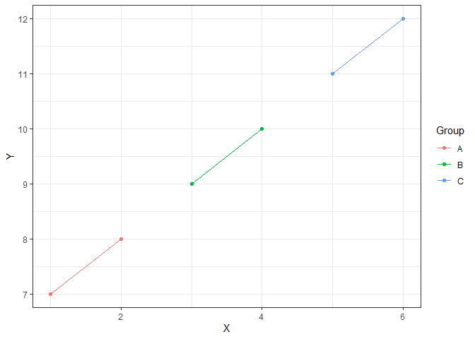

Assignment B-1
================
2023-11-02

\#Assignment B-1

This is the .Rmd file for assignment B-1. We will load tidyverse first
before we start.

``` r
suppressMessages(library(tidyverse))
```

Exercise 1: Make a function

In this exercise, I will be making a function and fortifying it. A few
days ago, I was working on a project that required me to graph a bunch
of scatterplots of mean concentration vs. time curves of a drug, in
order to check the shape of the curve visually. While doing so, I
thought that creating a function would be perfect for this task, as it
was quite repetitive. Before we go on, let’s first carefully examine
what processes were required to create the plot.

First, the datasets that I was using had 3 important
components/variables:

1.  Animal ID
2.  Mean Concentration (either mean serum concentration or mean CSF
    concentration)
3.  Time

For all of the different datasets, I first grouped the dataset by Animal
ID, then I filtered to removed any NA values in the dataset, the I
created a scatterplot with geom_point and geom_line.

We will create a function that is able to perform all of these tasks by
just inputting the data frame and the 3 corresponding variables in order
(data, group variable, x variable, y variable).

``` r
#' Create a Scatterplot with Grouping
#'
#' This function creates a scatterplot with grouping based on a specified variable.
#'
#' @param data A data frame containing the dataset to be plotted. Named "data" as it is the data frame that you are using to create the plot.
#' @param group_var A character string specifying the variable used for grouping the data. Named "group_var" as it is the variable that you are grouping by.
#' @param x_var A numeric variable for the x-axis of the scatterplot. Named "x_var" as it is the variable that goes on the x-axis.
#' @param y_var A numeric variable for the y-axis of the scatterplot. Named "y_var" as it is the variable that goes on the y-axis.
#'
#' @return A scatterplot with grouping based on the specified variable.
#'
#' @examples
#' createScatterplot(your_data_frame, "Group Column", "X Column", "Y Column")
#'
#' @import ggplot2 dplyr
createScatterplot <- function(data, group_var, x_var, y_var) {
  
  # Check if group_var is character
  if (!is.character(data %>% pull({{group_var}}))) {
    stop("group_var must be a character variable.")
  }
  
  # Check if x_var is numeric
  if (!is.numeric(data%>% pull({{x_var}}))) {
    stop("x_var must be a numeric variable.")
  }
  
  # Check if y_var is numeric
  if (!is.numeric(data %>% pull({{y_var}}))) {
    stop("y_var must be a numeric variable.")
  }
  
  # Groups data by a variable
  data_grouped <- data %>%
    group_by({{group_var}})
  
  # Filters out any NA values
  data_filtered <- data_grouped %>%
    filter(!is.na({{y_var}}))
  
  # Plots graph
  ggplot(data_filtered, aes(x = {{x_var}}, y = {{y_var}}, color = {{group_var}})) +
    geom_point() +
    geom_line() +
    theme_bw()
}
```

Now we have successfully created a function that allows us to choose a
dataset and the corresponding variables to group by and graph a plot.

Exercise 3: Include examples

Now, we will test out the function that we have created with a few
examples. I will create a simple dataset for this example that has
character variables and numerical variables for us to create a
scatterplot with.

``` r
# This code creates a custom dataset to use as an example
custom_data <- data.frame(
  Group = c("A", "A", "B", "B", "C", "C"),
  Group2 = c(1, 2, 1, 2, 1, 2),
  X = c(1, 2, 3, 4, 5, 6),
  Y = c(7, 8, 9, 10, 11, 12)
)

print(custom_data)
```

    ##   Group Group2 X  Y
    ## 1     A      1 1  7
    ## 2     A      2 2  8
    ## 3     B      1 3  9
    ## 4     B      2 4 10
    ## 5     C      1 5 11
    ## 6     C      2 6 12

Now let’s try creating a scatterplot with x-axis as “X” and y-axis as
“Y”, which are both numerical variables, that is grouped by “Group”,
which is a character variable.

``` r
# Let's use our function
createScatterplot(custom_data, Group, X, Y)
```

<!-- -->

Looks like it’s a success! Now, let’s also see what happens if we use a
non-character variable (numerical in this case) as our group_var.

``` r
# Let's use our function, but with a non-character variable as our group_var
createScatterplot(custom_data, Group2, X, Y)
```

    ## Error in createScatterplot(custom_data, Group2, X, Y): group_var must be a character variable.

As we can see here, we get the error message that states that group_var
must be a character variable, which is exactly what we intended.

Exercise 4: Test the Function

Before we start testing our function, let’s make sure to load the
testthat package.

``` r
suppressMessages(library(testthat))
```

Now let’s create some tests!

In the first test, we will check to see if we get a plot when we have
proper types of variables with no NA’s.

In the second test, we will see if we can still get a plot, even though
we have NA values.

The third test will check if using a wrong type of variable will give us
the expected error message. In this case, since we have a non-numerical
variable for our y-axis, we should be getting the error message: “y_var
must be a numeric variable.”

Lastly, the fourth test will check if we still get a plot when our
vector length is 0.

``` r
test_that("createScatterplot function tests", {
  
  # Test 1: Vector with no NA's
  data1 <- data.frame(
    Group = c("A", "A", "B", "B", "C", "C"),
    X = c(1, 2, 3, 4, 5, 6),
    Y = c(7, 8, 9, 10, 11, 12)
  )
  plot1 <- createScatterplot(data1, Group, X, Y)
  expect_true(!is.null(plot1), info = "Test 1 failed.")
  
  # Test 2: Vector with NA's
  data2 <- data.frame(
    Group = c("A", "A", "B", "B", "C", "C"),
    X = c(1, 2, 3, NA, 5, 6),
    Y = c(7, 8, 9, 10, 11, NA)
  )
  plot2 <- createScatterplot(data2, Group, X, Y)
  expect_true(!is.null(plot2), info = "Test 2 failed.")
  
  # Test 3: Vector of a different type
  data3 <- data.frame(
    Group = c("A", "A", "B", "B", "C", "C"),
    X = c(1, 2, 3, 4, 5, 6),
    Y = c("A", "B", "C", "D", "E", "F")
  )
  expect_error(createScatterplot(data3, Group, X, Y), "y_var must be a numeric variable.", info = "Test 3 failed.")
  
  # Test 4: Vector of length 0
  data4 <- data.frame(
    Group = character(0),
    X = numeric(0),
    Y = numeric(0)
  )
  plot4 <- createScatterplot(data4, Group, X, Y)
  expect_true(!is.null(plot4), info = "Test 4 failed.")

})
```

    ## Test passed 🎉

It looks like we were able to pass all of the tests!
